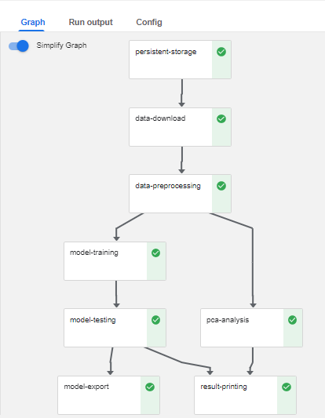

### Pipeline for Industrial Equipment Monitoring (Reusable)

## How to Implement Kubeflow Pipelines Components  
In this pipeline, we have the following components:  
1. Sensor data download component  
2. Preprocess the dataset component  
3. Train the model component  
4. Test model component  
5. Print Results component  
6. Export the trained model component  
  
The components are containerized using docker and pushed to a container registry. Skaffold is used for building and deploying the images.  
  

Authenticate to the container registry:  
  
```  
make docker-login  
```  
  
Build the images on the local:  
  
```  
make skaffold-build-local  
```  
  
Build and push to the registry:
  
```  
make skaffold-build  
```  
  
The pipeline components are compiled in a `yaml` format and deployed to kubeflow pipeline.  
  
The DAG for the successful kubeflow run is as given below.  
  
