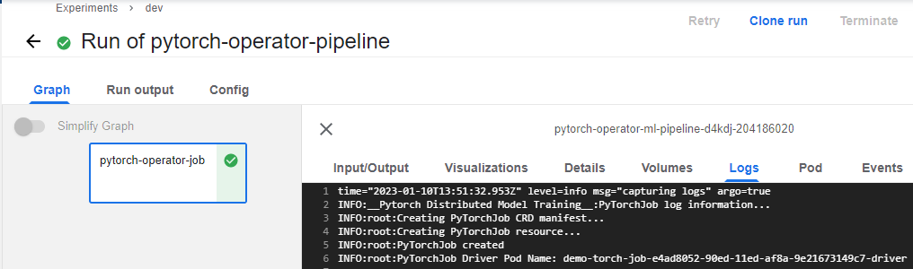
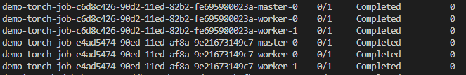

## **PyTorch Operator for Distributed Training**  
  
### **Authenticate to a Container Registry**:  
Update the `Makefile` with a Container Registry for the deployment.  
  
```  
make docker-login  
```  
  
### **Build and deploy the docker containers with skaffold**:  
Skaffold is used to build the container images and deploy to the container registry.  
  
```  
make skaffold-build  
```  
  
### **Compile the pipeline and deploy to kubeflow**:  
The pipeline is compiled in `yaml` format and deployed to kubeflow pipeline (ui).
  
```  
python3 pipeline/ml_operator_pipeline.py  
```  
  
The above command outputs a `yaml` file in the working directory. The `yaml` file is uploaded to kubeflow pipeline ui for a pipeline run.  
    
For this demo, the pipeline is a single component pipeline. The output of a successful run is similar to the image below.  
  
  
  
The pipeline deploys the PyTorchJob into the active kubernetes cluster.  
  
### **Monitoring the Training Job**:  
Since the job is deployed in the cluster, `kubectl` commands will be used to interact with the job in the cluster.  
  
To view the deployed pods running the training job:  
  
```  
kubectl -n kubeflow get pods  
```  
  
  
  
To view the logs of the training job runniing in the pods:  
  
```  
kubectl -n kubeflow logs <insert-the-name-of-master-or-worker-pod>  
```  
  
